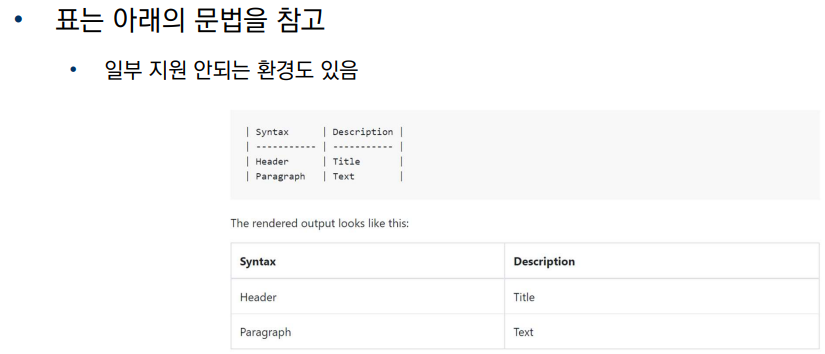
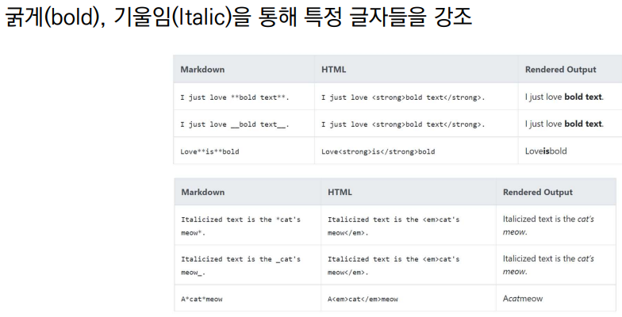

1. Heading

- h1 ~ h6 까지의 제목 강조

  

2. List

- ol, ul

- ol : 1. 2. 3.

- ul : -

  

3.Fenced Code block

\```

\```


4. Inline Code block

\` `

5. Link

\[text](url)


6. Image

\!\[text](url)


7. Blockquotes(인용문)

\>


8. 테이블
  

  

9. text 강조
  

  

10. 수평선

- \---
- \___
- \***